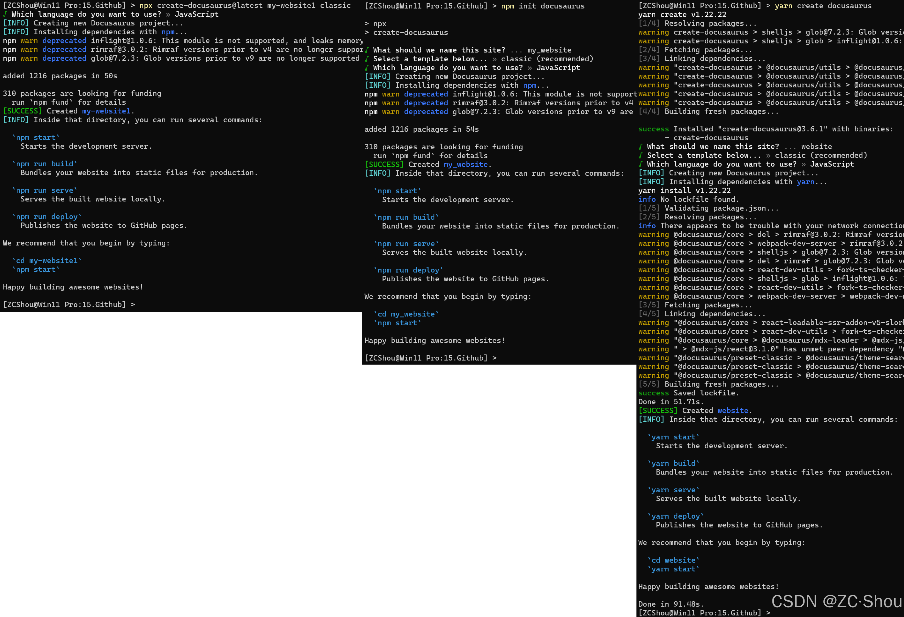
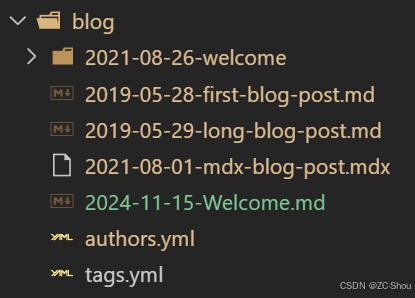
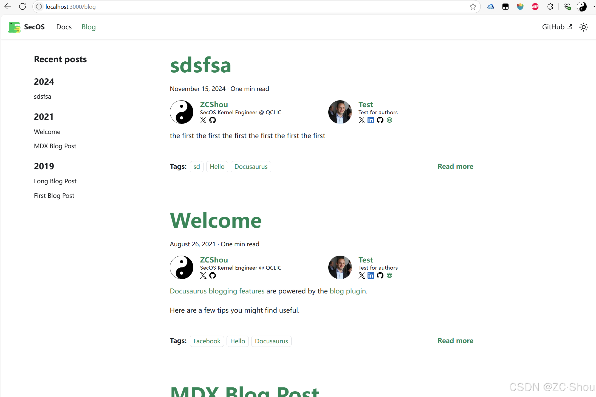
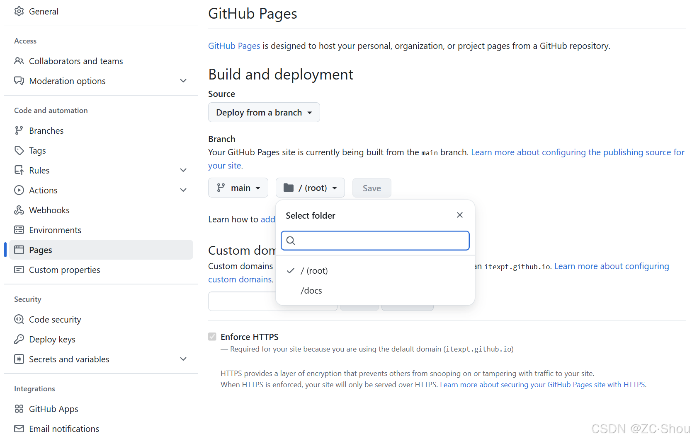
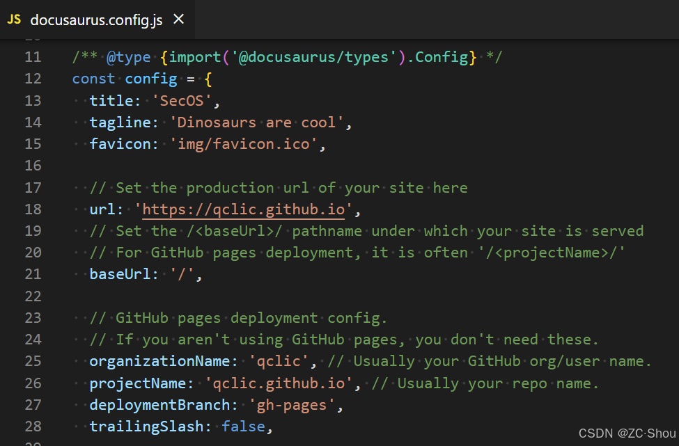
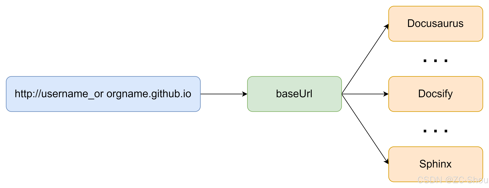
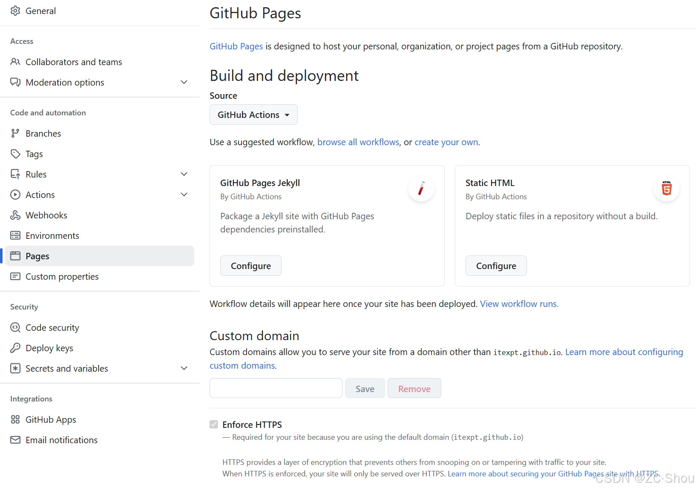

The InfisecOS documentation built using Docusaurus
<!-- truncate -->

## 简介

&emsp;&emsp;Docusaurus 是 Facebook（现更名为 Meta）开源的一个用于创建、维护和部署静态网站的工具。它适用于创建项目文档、团队文档和任何其他类型的文档。Docusaurus 集成了 Markdown、React 和一些自定义配置选项，可以帮助开发人员快速创建漂亮的文档网站。
- 官网：https://docusaurus.io/
- 源码：https://github.com/facebook/docusaurus
- 环境：2.x 版本要求 Node.js 16.14 及以上，3.x 版本要求 18.0 及以上

### 创建项目

&emsp;&emsp;要创建一个 Docusaurus 项目可以使用 Docusaurus 脚手架命令行工具 `npx create-docusaurus@latest my-website classic`，也可以直接使用原始命令 `npm init docusaurus` 或 `yarn create docusaurus` 来进行创建，创建过程中会让我们选择几个基本配置。



- 脚手架命令 `npx create-docusaurus@latest my-website classic` 实际上是对 `npm init docusaurus` 的进一步封装，创建出来的项目目录与后者创建的是一样的
- 参数 classic 表示使用 classic 模板作为网站的基本样式；my-website 是存放 Docusaurus 项目源码文件的目录名字以及我们的网站的名字；JavaScript 表示 Docusaurus 的开发语言

## 配置

&emsp;&emsp;无论使用哪个命令来创建项目，创建后的项目的目录结构如下所示，整个站点的主要配置都位于 `docusaurus.config.js` 中。


### blog

&emsp;&emsp;Docusaurus 通过 Blog Plugin 这个插件为我们提供了一个功能齐全的 blog 发布页面的特性，对应于 `blog` 目录中的各种 Markdown 文件。



- 通过在 `docusaurus.config.js` 中添加或删除如下配置项可以选择启用或禁用博客插件，禁用后则可以删除 `blog` 目录，也可以在设置路径选项后更改其名称。
    ```js
    export default {
    themeConfig: {
        // ...
        navbar: {
        items: [
            // ...
            // to: 指定 blog 对应的路径；label: 指定早导航栏中显示的名字；position: 指定 label 在导航栏的位置
            {to: 'blog', label: 'Blog', position: 'left'}, // or position: 'right'
        ],
        },
    },
    };
    ```
- 在默认情况下，博客的索引页面（默认情况下，它位于 `/blog`）是博客列表页面，所有的博客文章都在这个页面上显示。

    

### docs

&emsp;&emsp;`docs` 包含文档的 Markdown 文件。在 sidebars.js 中自定义 docs 侧边栏的顺序。如果您已经禁用了 docs 插件，您可以删除该目录，或者您可以在设置 path 选项后更改其名称。

### src

&emsp;&emsp;`src` 目录中是一些非文档文件，如页面或自定义 React 组件。
- `pages`： 此目录中的任何 JSX/TSX/MDX 文件都将转换为网站页面。
- `components`： 存放一些共用的组件
- `css`：存放针对当前主题的自定义样式

### static

&emsp;&emsp;`static` 静态目录中的任何内容都将被复制到最终构建目录的根目录中

### 其他文件

- `docusaurus.config.js`： 一个包含站点配置的配置文件，相当于 Docusaurus v1 中的 siteConfig.js
- `package.json`： 使用的 npm 包
- `sidebars.js`：  由文档使用，用于指定边栏中文档的顺序

## 部署
&emsp;&emsp;Docusaurus 最终为我们提供一个网站作为文档的浏览界面。

### 本地部署

&emsp;&emsp;可以使用像 Apache2 或 Nginx 这样的 HTTP 服务器进行再本地进行自主托管。只需要执行 `npm run serve -- --build --port 80 --host 0.0.0.0` 或 `yarn serve --build --port 80 --host 0.0.0.0` 命令就可以使用 `docusaurus serve` 自我托管 Docusaurus 网站。

> 如果省略 `--port 80 --host 0.0.0.0` 则默认为 127.0.0.1:3000，可以方便我们在本地调试

### Github Pages

&emsp;&emsp;要将我们的 Docusaurus 网站部署在 Github Pages 上，首先需要在 Github 上创建一个仓库。在仓库的设置中可以看到，现在的 Github Pages 支持 `Deploy from a branch` 和 `GitHub Actions` 两种部署类型，Docusaurus 对这两种部署方式都是支持的。


- `Deploy from a branch`：默认的部署方式，需要指定部署使用的仓库分支以及目录（只能是仓库根目录或者仓库根目录下的 docs 目录）
    
	Docusaurus 已经为我们封装好了一键部署的命令：
	- Linux：
	    - Using SSH：`USE_SSH=true npm run deploy`
	
	    - Not using SSH：`GIT_USER=<Your GitHub username> npm run deploy`

	- Windows PowerShell：
		- Using SSH：`cmd /C 'set "USE_SSH=true" && npm run deploy'`
	
	    - Not using SSH：`cmd /C 'set "GIT_USER=<Your GitHub username>" && npm run deploy'`

	该命令会自动解析 `docusaurus.config.js` 中关于部署到 Github Pages 需要的配置项，默认生产的 `docusaurus.config.js` 中相关配置可能不全
    
	- `url` 和 `baseUrl`： 这两个配置项就是我们网站使用的域名。需要注意，Github 只对用户提供一个名为 `用户名或组织名.github.io` 的域名，如果有多个网站部署，则可以通过指定不同的 `baseUrl` 来区分
    
	- `organizationName`：必须是我们仓库所有者的名字，也就是用户名或组织名
	- `projectName`：我们 Github 上仓库的名字
	- `deploymentBranch`：部署我们的网站使用的仓库分支的名字
	- `trailingSlash`：域名最后的那个斜杠 `/`。这里设置为 false 表示不要加 `/`，默认情况下，GitHub 页面会在 Docusaurus 的 URL 中添加一个尾部斜杠。

- `GitHub Actions`：即使用我们自定义的 GitHub Actions 来进行部署
    
	这种部署方式需要在项目中新建 `.github/workflows/deploy.yml` 文件（创建目录，文件名可以自定义），然后在 `*.yml` 中输入以下内容即可
	```c
	name: Deploy to GitHub Pages
	
	on:
	  workflow_dispatch:
	  push:
	    branches:
	      - main
	
	jobs:
	  build:
	    name: Build Docusaurus
	    runs-on: ubuntu-latest
	    steps:
	      - uses: actions/checkout@v4
	        with:
	          fetch-depth: 0
	      - uses: actions/setup-node@v4
	        with:
	          node-version: 18
	          cache: npm
	
	      - name: Install dependencies
	        run: npm ci
	      - name: Build website
	        run: npm run build
	
	      - name: Upload Build Artifact
	        uses: actions/upload-pages-artifact@v3
	        with:
	          path: build
	
	  deploy:
	    name: Deploy to GitHub Pages
	    needs: build
	
	    # Grant GITHUB_TOKEN the permissions required to make a Pages deployment
	    permissions:
	      pages: write # to deploy to Pages
	      id-token: write # to verify the deployment originates from an appropriate source
	
	    # Deploy to the github-pages environment
	    environment:
	      name: github-pages
	      url: ${{ steps.deployment.outputs.page_url }}
	
	    runs-on: ubuntu-latest
	    steps:
	      - name: Deploy to GitHub Pages
	        id: deployment
	        uses: actions/deploy-pages@v4
	```

## 参考
1. https://www.wbolt.com/docusaurus.html
2. https://juejin.cn/post/7206955531998675005
3. https://juejin.cn/post/7365757742381957161
