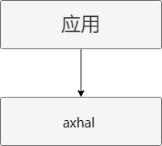
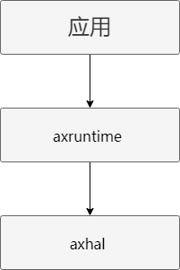
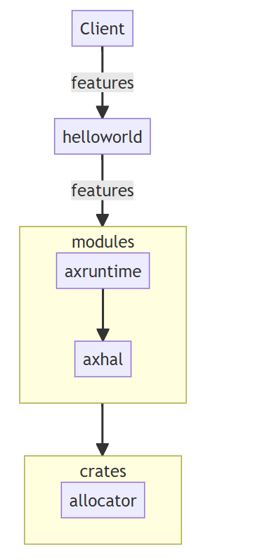
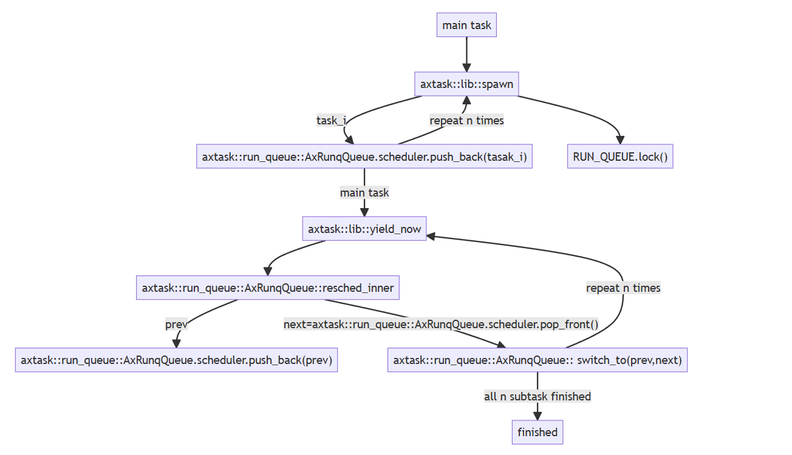

# Technical details

TODO

### axhal 组件
在 InfisecOS 中，axhal 组件提供了一层针对不同硬件平台的硬件封装，它为指定的操作平台进行引导和初始化过程，并提供对硬件的操作。例如 modules/axhal/src/platform/qemu_virt_riscv/console.rs 里面提供了对字符输出的封装，我们可以直接调用其中的 putchar 函数进行字符的输出，而不是一次又一次地使用 sbi 这样汇编级别的代码进行输出。

我们看到 boot.rs 的汇编代码最后有一段跳转到 entry 的代码， 目前来说，InfisecOS 运行到这里之后，就会跳转到 rust_entry 函数（在axhal/src/platform/qemu_virt_riscv/mod.rs 文件中），这个函数会执行一些初始化流程，然后调用rust_main 函数（在 modules/axruntime/src/lib.rs 文件中）， rust_main 函数会根据选择的 feature 进行初始化的流程， 最后会调用应用程序的 main 函数。

```c
extern "C" {
    fn trap_vector_base();
    fn rust_main(cpu_id: usize, dtb: usize);
    fn main();  // 从外部引入main函数
    #[cfg(feature = "smp")]
    fn rust_main_secondary(cpu_id: usize);
}

unsafe extern "C" fn rust_entry(cpu_id: usize, dtb: usize) {
    crate::mem::clear_bss();
    crate::cpu::init_primary(cpu_id);
    crate::arch::set_trap_vector_base(trap_vector_base as usize);
    // rust_main(cpu_id, dtb);
    main();  // 跳转到应用程序的main函数
    self::misc::terminate();  // 程序运行后终止
}
```

为避免引入过多组件， 我们直接将 axhal/src/platform/qemu_virt_riscv/mod.rs 里面 rust_entry 中调用的 rust_main() 函数换成应用程序的 main 函数(记得要在上面 extern 引用 main 函数)， 并加上一行 self::misc::terminate()， 方便 InfisecOS 运行完程序后终止，以防止SecOS卡死不能正常退出（目前退出的功能依赖于下一部分提到的axruntime组件）。

### axruntime
如果我们需要支持更复杂的应用，axhal 提供的低级的裸机环境肯定不能满足我们的需求， 那么就需要用到 axruntime 这个更强大的组件了。axruntime 的主要功能是在进入应用程序的 main 函数之前执行一些初始化操作， 根据所选择的不同 feature 执行相对应的初始化过程。

在 axhal 执行完后不是直接跳转到应用程序的 main 函数， 而是跳转到 axruntime 这个组件的 rust_main 函数，再跳转到 helloworld 的 main 函数。

### feature
feature 的参数控制也是 InfisecOS 的强大功能之一，和之前的部分不同，用户从开启或关闭 feature 变成了具体调整 feature 特性的参数，以达到自己所需要的最佳环境支持。用户通过运行命令来调整 feature 的流程可以用下图来表示：

结合图中展示和具体实现部分，用户 (Client) 通过命令传递想要控制的参数，自顶往下由 helloworld 传递到 modules，最终抵达 modules/axruntime/src/lib.rs(123 行)`axlog::set_max_level(option_env!("LOG").unwrap_or(""));`这行代码, 接收用户在命令上设置的`LOG`控制参数来实现对日志过滤等级的控制。

### 协作式多任务
从操作系统的角度来看，协作式多任务只是一个执行线程，在其中，应用程序在处理多个请求/命令之间切换。通常情况是：只要一些数据到达，就会读取它们，解析请求，将数据发送到数据库，这是一个阻塞操作；而非堵塞操作时在等待来自数据库的响应时，可以开始处理另一个请求，它被称为“合作或协作”，因为所有任务/命令必须通过合作以使整个调度方案起作用。它们彼此交错，但是有一个控制线程，称为协作调度程序，其角色只是启动进程并让这些线程自动将控制权返回给它。

这比线程的多任务处理更简单，因为程序员总是知道当一个任务执行时，另一个任务不会执行，虽然在单处理器系统中，线程应用程序也将以交错模式执行这种模型，但使用线程的程序员仍应考虑此方法的缺陷，以免应用程序在移动到多处理器系统时工作不正常。但是，即使在多处理器系统上，单线程异步系统也总是以交错方式执行。

#### 协作式多任务的主体实现

协作式多任务是一种任务调度方式，它与抢占式多任务(preemptive)相对应，关于后者，我们将在下一章详细说明。在本章学习中，我们先要了解“non-preeptive"——或者说是协作的调度方式。比起抢占，它显得更加友善而不具有侵略性。要设计一个协作式多任务的unikernel，需要满足这些要求：

1.  任务切换机制：实现任务的切换和调度，确保多个任务在适当的时候轮流执行。任务切换应该是协作式的，即任务自愿放弃执行权，而不是由系统强制进行切换。这部分的需求确定了unikernel需要依赖于`axtask`这一module以及`multitask`、`sched_fifo`、`sched_cfs`等任务管理相关的crates。
    
2.  上下文保存与恢复：在任务切换时，需要保存当前任务的上下文（包括寄存器、程序计数器、堆栈等状态），以便后续能够正确地恢复该任务的执行状态。这也包括了允许任务在运行过程中主动挂起自己，将执行权让给其他任务。同时，需要提供相应的机制来恢复挂起的任务继续执行。
    
3.  任务优先级管理：支持为不同的任务设置优先级，以确保高优先级的任务在系统资源有限时能够优先得到执行。在SecOS支持的app中，`apps_priority`实现了这个目标。
    
4.  任务同步与通信：提供机制来实现任务之间的同步和通信，以防止竞态条件和数据访问冲突。在SecOS中，我们可以参考app `parallel`了解具体的实现。
    
5.  定时器和延时：提供定时器功能，允许任务在一定时间后唤醒或执行延时操作。在SecOS中，我们可以参考app `sleep`了解具体的实现。

#### 调试和运行需求
在Hello World的实现过程中，我们已经初步了解了SecOS从代码再到硬件的落地，最后在嵌入式设备实机运行的过程。在本章，读者可以利用上一章的经验，在硬件设备对生成的二进制镜像进行调试。为此，在最终烧录时SecOS也将实现开发者的调试和改造需求：

1.  异常处理：处理任务执行过程中可能出现的异常情况，例如任务错误、内存越界等情况。这些比较难处理的错误需要日志的打印来实现，具体操作我们沿用了HelloWorld中的处理，同时引入了app `exception`细化异常打印日志。
    
2.  系统可扩展性：设计具有良好可扩展性的任务管理机制，允许动态地创建和销毁任务，以适应不同应用场景和任务数量的需求。在实现这个unikernel的app中（`parallel`、`priority`、`sleep`、`yield`），我们都进行了编译内核数、架构、日志输出粒度等的自由设置。
    
这些功能需求可以根据不同的应用场景和系统设计来进行调整和扩展。实现协作式多任务的关键在于任务的合作和互相信任，确保任务在适当的时机让出执行权，以实现良好的系统响应性和资源利用率。

### 协作式多任务相关的crates/modules
Crate 更严格的定义是一个**用于生成库或可执行文件的树形模块结构**。Rust 中，模块和单独的文件不存在必然关联。 在编写 Rust 程序时，可以不使用模块。但是当一个 crate 中的代码越来越多时就会变得不好维护，所以就可以将其拆分成一个个独立的模块，以便于增强于可读性和代码复用。 定义模块使用 mod 关键字。也就是说，一个文件中可以没有模块，也可以有多个模块。文件和模块不是一对一的关系。 Rust 中的模块是一种 同时，Module 还能控制代码的可见性，也就是将代码分为公开代码和私有代码，公开代码可以在项目外被使用，私有代码只能在项目内被访问。

#### 协作式多任务unikernel依赖modules
想要确定一个任务什么时候需要终止运行或是与其它任务共享有限的资源，我们必须首先明确各个任务之间的优先级区别，而优先级一般是由各个任务的到达时间、运行时间等参数确定的。上面这段话涉及到两个关键点——任务本身和SecOS选择的策略，分别对应到两个module：`axtask`以及`axalloc`；前者负责任务本身（如运行时长等）调配，后者负责操作系统的内存分配策略（cfs、fifo、rr等）的分配。

对于这些分配的算法目前都已经有了成型的实现方法，换句话说它们其实是与操作系统无关的。对于SecOS，我们可以借助这个特点将它们封装成与系统无关的modules。

对于不同的任务，我们在priority中的`main.rs`进行了手动规定，读者也可以通过修改其中参数运行来观察优先级在不同策略下的分配：
```c
const TASK_PARAMS: &[TaskParam] = &[
    // four short tasks
    TaskParam {
        data_len: 40,
        value: 1000000,
        nice: 19,
    },
    TaskParam {
        data_len: 40,
        value: 1000000,
        nice: 10,
    },
    TaskParam {
        data_len: 40,
        value: 1000000,
        nice: 0,
    },
    TaskParam {
        data_len: 40,
        value: 1000000,
        nice: -10,
    },
    // one long task
    TaskParam {
        data_len: 4,
        value: 10000000,
        nice: 0,
    },
];
```

在上面的代码里我们规定了四个短任务和一个长任务，长度在参数`value`中确定任务的长度。有兴趣的同学可以在SecOS的根文件目录下尝试运行以下命令体验不同的分配策略效果。
```c
test_one "SMP=1 LOG=info" "expect_info_smp1_fifo.out"
test_one "SMP=1 LOG=info APP_FEATURES=sched_cfs" "expect_info_smp1_cfs.out"
test_one "SMP=1 LOG=info APP_FEATURES=sched_rr" "expect_info_smp1_rr.out"
test_one "SMP=4 LOG=info APP_FEATURES=sched_cfs" "expect_info_smp4_cfs.out"
```

通过上面的任务，相信读者对`axtask`以及`axalloc`的功能已经有了初步的认识,接下来我们可以通过SecOS提供的`yield`app来阐明与实现协作式多任务相关的crates。

#### yield：产生多线程的测试
在上面的app中，我们实现了任务的调度，下一个目标即是实现任务间的切换。在任务切换中，线程间的切换相较于线程容易不少，所以我们先从`yield`这一app开始，初步了解实现协作式多任务最终目标前modules和crates是如何衔接的。

现代的任务调度算法基本都是抢占式的，它要求每个应用只能连续执行一段时间，然后内核就会将它强制性切换出去。 一般将 时间片 (Time Slice) 作为应用连续执行时长的度量单位，每个时间片可能在毫秒量级。 一般使用时间片轮转算法 (RR, Round-Robin) 来对应用进行调度。为了实现协作的目标，在运行和测试这个app过程中需要选择传统的cfs或fifo进行测试。

```c
fn main() {
    for i in 0..NUM_TASKS {
        task::spawn(move || {
            println!("Hello, task {}! id = {:?}", i, task::current().id());
            // 此时已经启动了yield
            // preempt所需要的依赖libax/sched_rr并没有被包含进去,所以这里默认为协作式实现
            #[cfg(not(feature = "preempt"))]
            task::yield_now();

            let order = FINISHED_TASKS.fetch_add(1, Ordering::Relaxed);
            if option_env!("SMP") == Some("1") {
                assert!(order == i); // FIFO scheduler
            }
        });
    }
    println!("Hello, main task{}!");
    while FINISHED_TASKS.load(Ordering::Relaxed) < NUM_TASKS {
        #[cfg(not(feature = "preempt"))]
        task::yield_now();
    }
    println!("Task yielding tests run OK!");
}
```
这是一个利用fifo算法进行线程管理的示例程序。从代码实现细节来看，主要分成两步实现：

1.  操作系统初始化，加载yield app。
2.  使用`task::spawn`循环来生成`NUM_TASKS`任务（类似于线程）。 每个任务执行一个函数，只需打印其ID即可。 如果禁用抢占，也就是应用协作式方法，任务会自动执行`yield`以放弃CPU。如果不使能SMP，使用单核编译，任务的执行顺序必须是`FIFO`。 `main task`将等待所有其他任务完成。如果没有，则继续执行`yield`并等待。

也就是说我们如果不规定APP_FEATURE内参数为抢占，那么将默认采取协作式进行实现。读者可以通过运行以下命令进行测试：

`make A=apps/task/yield ARCH=riscv64 LOG=info NET=y SMP=1 run`

启动yield的同时，我们实现了更加细节部分的调用，流程图如下：

可以看到，我们在实现协作式多任务相关的unikernel时，需要在统一的接口实现内存分配的算法，包括了`alloc`和`paging`。实现具体分配算法时，则需要调用多任务相关的`multitask`和`schedule`两个crates。
